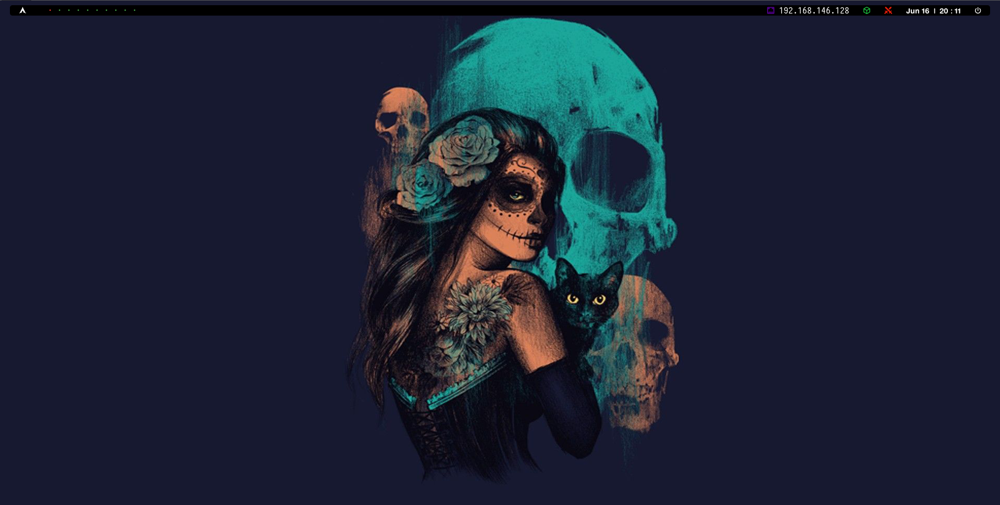

# myBSPWM

### TESTED ON:
- Kali Linux
- Parrot OS

## 1.- Installation

```
#For kali and ubuntu
sudo apt-get update && sudo apt-get upgrade -y
#For parrot
sudo apt-get update && sudo parrot-upgrade -y
```
```
git clone https://github.com/PatxaSec/myBSPWM.git
```
```
cd myBSPWM
```
```
chmod +x install.sh
```
```
./install.sh
```
## 2.- Shortcuts (atajos de teclado)

<kbd>Windows</kbd> + <kbd>Enter</kbd> : Abrir la terminal (kitty).  

<kbd>Windows</kbd> + <kbd>W</kbd> : Cerrar la ventana actual.  

<kbd>Windows</kbd> + <kbd>Alt</kbd> + <kbd>R</kbd> : Recargar la configuración del bspwm.  

<kbd>Windows</kbd> + <kbd>Alt</kbd> + <kbd>Q</kbd> : Cerrar sesión.  

<kbd>Windows</kbd> + <kbd>(⬆⬅⬇➡)</kbd> : Moverse por las ventanas en la workspace actual.

<kbd>Windows</kbd> + <kbd>Alt</kbd> + <kbd>(⬆⬅⬇➡)</kbd> : cambiar tamaño de la ventana seleccionada en la workspace actual.

<kbd>Windows</kbd> + <kbd>D</kbd> : Abrir el Rofi para la busqueda de herramientas. <kbd>Esc</kbd> para salir.  

<kbd>Windows</kbd> + <kbd>(1,2,3,4,5,6,7,8,9,0)</kbd> : Cambiar el workspace. 

<kbd>Windows</kbd> + <kbd>Shift</kbd> + <kbd>(1,2,3,4,5,6,7,8,9,0)</kbd> : Mover ventana actual a otro workspace.

<kbd>Windows</kbd> + <kbd>Shift</kbd> + <kbd>F</kbd> : Abrir Firefox.

<kbd>Windows</kbd> + <kbd>Shift</kbd> + <kbd>B</kbd> : Abrir Burpsuite.


## 3.- Wallpapers

5 diferent wallpaper options:
- [Anime](Wallpaper/a.jpg)
- [Dia de muertos](Wallpaper/cat.jpg)
- [AC Valhalla](Wallpaper/eivor.jpg)
- [MR Robot](Wallpaper/fsociety.jpg)
- [Black Panther](Wallpaper/wakanda.jpg)

## 4.- Ejemplo de Entorno


---

